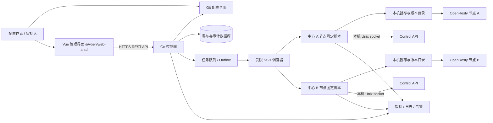
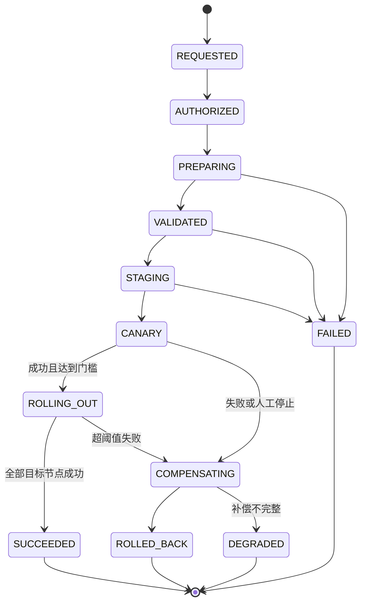

# 多中心 OpenResty 配置管理平台设计方案

> 文档状态：设计基线（供评审和后续实现）  
> 适用目标：多中心、多节点的 HTTP/HTTPS 与 TCP/UDP 配置集中管理  
> 当前实现原则：MySQL 保存结构化配置、版本快照和审计，Go 控制面编排发布，Vue Web 提供图形化管理，OpenResty Lua 承载可热更新运行时规则，Control API 负责原生配置 reload；生产运行时不依赖 AI。

> 文档状态说明：本文保留了项目早期 Git/SSH 方案的设计推演，当前代码已切换为 MySQL 运行时配置。实际开发和部署以 `README.md`、`CONTEXT.md`、ADR-0011 及当前 `docker-compose.yaml` 为准。

## 1. 执行摘要

平台采用“Git 配置仓库 + Vue 管理前端 + Go 控制面 + 受限 SSH/节点本机发布脚本 + OpenResty 数据面”的架构。前端使用 `@vben/web-antd` 快速构建，提供中心、节点、协议、域名、端口、API、访问策略、版本、发布、回滚和审计界面。所有变更先进入 Git 并经过审核；部署固定到不可变 commit；控制面生成中心级发布计划，经受限 SSH 调度节点本机固定脚本；节点在切换前验证配置，随后原子切换活动配置并由本机脚本通过 Unix socket 调用 Control API 触发 reload；系统逐节点记录结果并在失败时执行补偿回滚。

不部署常驻节点代理。Go 控制面只通过专用 SSH 用户调用节点上预置的固定发布脚本；该账号不能获得任意 shell，sudo 仅允许白名单脚本。脚本在节点本机负责文件暂存、nginx -t、原子切换、访问 Control API 的本机 Unix socket、健康检查及回滚。Go 控制面不直接连接节点 Control API，也不持有 root SSH 权限。

设计基线假设：使用支持 Control API 的 OpenResty/NGINX 构建，并在验证阶段确认其版本及编译参数。若所用 OpenResty 构建没有该 API，必须选择受支持的发行版/构建，或明确采用受限信号控制作为替代；不可把 API 能力视作所有 Nginx 版本默认具备。

## 2. 目标、范围与非目标

### 2.1 目标

- 管理多中心 HTTP、HTTPS、TCP 和 UDP 配置，支持共享配置和中心差异。
- 每次发布可追溯到 Git commit、审批、发布批次、目标节点和验证结果。
- 发布失败可停止扩散，并将已变更节点补偿回滚至已知健康版本。
- 同一中心所有节点从同一 Git commit 和同一组受控变量构建配置。
- 不在生产管理服务中集成 AI/ML；AI 可在开发期辅助生成，经人工审核和自动校验后提交 Git。

### 2.2 范围

包括配置仓库结构、配置装配与校验、发布编排、节点执行、回滚、管理 Web、审计、权限、可观测性、灾备和运维流程。

### 2.3 非目标

- 不管理 OpenResty 二进制升级、操作系统升级或业务后端发布。
- 不在本期实现任意 Nginx 指令的在线编辑器或运行时 AI。
- 不把 Nginx 配置文件直接作为唯一的秘密管理系统。

## 3. 架构与信任边界



### 3.1 组件职责

| 组件 | 职责 | 不应承担的职责 |
|---|---|---|
| Git 仓库 | 保存配置源文件、校验工具、模板与变更历史；保护分支和审批 | 保存明文私钥；充当发布运行状态数据库 |
| Go 控制面 | 身份鉴权、授权、校验编排、发布计划、锁、状态机、审计、版本查询；经受限 SSH 触发固定节点脚本 | 在请求线程中执行长时间远程命令；直接连接 Control API；持有 root 私钥或任意 shell 权限 |
| Vue 管理界面 | 展示中心拓扑、配置对象、版本差异、发布状态和审计；通过 API 发起授权操作 | 直接连接 Git、数据库、节点 SSH 或 Nginx Control API；在浏览器保存秘密 |
| 节点固定发布脚本 | 校验任务参数、接收/读取制品、暂存、nginx -t、原子切换、本机 Control API 调用、健康检查、回报结果 | 接受任意命令、任意路径或任意 nginx 指令 |
| OpenResty | 使用活动配置处理流量；通过本机控制接口 reload | 访问 Git 或管理数据库 |
| 数据库与队列 | 保存发布状态和任务；支持恢复及幂等消费 | 替代 Git 作为配置事实来源 |
| 秘密管理系统 | 提供证书、私钥等秘密及版本引用 | 将秘密散落在仓库普通文本中 |

### 3.2 网络与主机边界

- 控制面仅访问 Git、数据库、队列和登记节点的 SSH 管理地址；使用专用账号、短期/轮换凭证、来源限制和 SSH host key 校验。
- SSH 强制命令或受限命令入口只接受任务 ID、制品 ID、目标版本等结构化参数；禁止拼接用户输入到 shell，sudoers 只允许调用固定 root-owned 脚本。
- Control API 绑定 Unix socket，socket 权限只允许节点固定脚本所用的专用本机身份访问，不暴露公网、管理网或业务网。
- 发布任务带签名制品摘要、过期时间和幂等 ID；凭证轮换与吊销由统一密钥系统管理。
- 管理 Web 与控制面通过 HTTPS 通信；启用企业 SSO/OIDC、CSRF 防护（若使用 Cookie 会话）、严格 CORS/CSP 与安全响应头。浏览器只持有短期身份会话，不接触 Git/SSH/Control API 凭证。

## 4. Nginx/OpenResty 运行基线

除 OpenResty HTTP Lua 模块外，若需 Stream/TCP/UDP 的 Lua 策略评估，还必须在实际构建中提供并验证相应的 Stream Lua 能力。HTTP 头/体路由策略只用于七层代理；四层策略只依据连接层可见属性执行。所有 Lua 逻辑作为平台固定、受审查、版本化的策略引擎，不允许从 Web 或配置仓库注入任意可执行 Lua 代码。

访问策略中的 `access_by_lua` 等钩子必须由受控基线配置和预先审查的固定模块接入，业务配置只提供生成后的数据文件引用。策略配置不得在请求期间访问管理面 REST API、Git 或数据库；策略数据在启动/发布时装载到受限本地数据结构，规则变更通过正常配置发布和 reload 生效。

### 4.1 固定主配置

`nginx.conf` 由平台基线包或主机配置管理系统维护，不接受业务发布覆盖。它只提供主上下文参数、目录入口和受控 include 点，例如：

```nginx
worker_processes auto;
error_log /var/log/openresty/error.log warn;
pid /run/openresty/nginx.pid;

events {
    worker_connections 4096;
}

http {
    include mime.types;
    include /etc/openresty/managed/common/http/map/*.conf;
    include /etc/openresty/managed/common/http/limit/*.conf;
    include /etc/openresty/managed/common/http/log/*.conf;
    include /etc/openresty/managed/common/http/upstream/*.conf;
    include /etc/openresty/managed/center/http/upstream/*.conf;
    include /etc/openresty/managed/common/http/server/*.conf;
    include /etc/openresty/managed/center/http/server/*.conf;
}

stream {
    include /etc/openresty/managed/common/stream/log/*.conf;
    include /etc/openresty/managed/common/stream/upstream/*.conf;
    include /etc/openresty/managed/center/stream/upstream/*.conf;
    include /etc/openresty/managed/common/stream/server/*.conf;
    include /etc/openresty/managed/center/stream/server/*.conf;
}
```

此为结构示意，实际模板须验证 `stream` 模块、include 顺序、SSL 指令上下文、OpenResty 打包路径和现存发行版配置。由校验工具检查业务文件不得进入错误上下文。location 片段不由顶层直接 include，而由对应 server 在 server 上下文中 include。

### 4.2 上下文类型

- `http {}` 与 `stream {}` 是不同配置上下文；HTTP 的 `server`/`upstream` 与 Stream 的 `server`/`upstream` 不可互换。
- 一个业务文件仅包含一种配置对象。`location` 是 `server` 内部对象，因此 location 文件属于 server 的片段文件，由 server 内部 include。
- `map`、`limit_req_zone`、`log_format`、SSL 公共参数须分别定义合法上下文和加载点。不能把所有公共片段盲目 include 到同一个目录入口。
- HTTP server 的 TLS 指令位于 HTTP server 上下文；Stream TLS 透传/终止按对应 Stream 模块能力另行定义，不能套用 HTTP 指令。

### 4.3 版本与能力门禁

发布节点注册时采集并核验：OpenResty/NGINX 版本、构建参数、模块清单、主配置路径、配置根目录、Control API 能力和 socket 权限。版本/能力与配置所需指令不匹配则拒绝发布。生产环境统一镜像或软件包摘要，并在发布记录中保存其标识。

## 5. Git 配置仓库规范

### 5.1 目录建议

```text
nginx-config-repo/
├── README.md
├── policy/
│   ├── schema/
│   ├── rules/
│   └── compatibility/
├── scripts/
│   ├── validate-config.sh
│   ├── render-config.sh
│   └── verify-layout.sh
├── common/
│   ├── http/
│   │   ├── map/
│   │   ├── limit/
│   │   ├── log/
│   │   ├── ssl/
│   │   ├── upstream/
│   │   └── server/
│   └── stream/
│       ├── log/
│       ├── upstream/
│       └── server/
├── centers/
│   └── cn-east-1/
│       ├── manifest.yaml
│       ├── http/
│       │   ├── upstream/
│       │   ├── server/
│       │   └── location/
│       │       └── orders/
│       └── stream/
│           ├── upstream/
│           └── server/
└── examples/
```

`scripts/`、`policy/` 是发布校验所需文件；sparse-checkout 必须一并拉取，或从与配置 commit 绑定的可信校验工具制品中取得。配置仓库的 sparse 目标因此不是仅两个目录：至少包括 `common/`、`centers/<center-id>/`、`policy/` 和 `scripts/`（若校验工具独立打包，则记录其不可变版本和摘要）。

### 5.2 命名规范

- 统一小写，语义段用点号；禁止随机值、时间戳和人工版本后缀。
- 为消除原要求的矛盾，默认对象统一使用 `default.` 前缀，不使用 `_default`；禁止语义性下划线和连字符。中心 ID 可采用受控登记格式，例如 `cn.east.1`，但需避免与目录层级混淆，目录值由登记表校验。
- HTTP upstream：`http/upstream/<service>.conf`。
- HTTP server：`http/server/<domain>.<port>.conf`；HTTPS 独立文件：`http/server/<domain>.<port>.ssl.conf`。
- HTTP location：`http/location/<service>/<action>.conf`。路径段只用已登记服务和动作标识。
- Stream upstream：`stream/upstream/<service>.conf`。
- Stream TCP server：`stream/server/<service>.<port>.conf`；UDP：`stream/server/<service>.<port>.udp.conf`。
- 同域名不同端口必须独立文件。每个文件只声明一个对象；location 文件只声明一个 location 片段。

### 5.3 元数据

每个配置文件使用注释头：

```nginx
# config_id: centers.cn.east.1.http.server.api.example.com.9080.conf
# version: git:<由发布记录解析的完整 commit>
# updated: <提交时由工具生成的 UTC ISO-8601 时间>
# author: <ai|用户标识|自动化身份>
```

建议将 `version` 在 Git 中保存为 `version: git` 或省略，并由发布制品清单写入实际 commit，避免每次提交因自引用 commit hash 造成无法生成的循环依赖。若要求文件内必须含版本值，应定义为业务配置版本而非 Git commit。`updated`、`author` 是审计提示，可信审计以 Git 作者/签名和控制面审计记录为准，不能信任可手写注释。

### 5.4 配置内容约束

**HTTP/Stream upstream**

- 一个文件一个 upstream，唯一名称，并在 manifest 中登记上下文类型。
- 每个 server 行明确 `max_fails`、`fail_timeout`（若单节点，其参数不提供有效摘除能力，校验器给出告警或按策略拒绝）。
- 需要 `keepalive` 的 HTTP 代理 upstream 必须设置合理值；Stream 是否支持及其连接复用能力按实际模块版本决定，不机械套用 HTTP 要求。
- 主动健康检查必须显式声明所依赖的商业模块/版本；不具备模块时只能使用被动失败判断，不得标为主动健康检查。

**HTTP server**

- 一个文件一个 `server` 块；仅一个 listen endpoint（每条监听配置拆分为独立 server），默认 server 的选择规则需明确。
- 必须定义 access/error 日志策略，日志路径或标识必须包含监听端口；推荐日志格式由公共 log 配置统一管理。
- 必须 include 至少一个业务 location 片段和兜底 location 片段；include 路径必须在发布目录中解析成功。
- `/` 兜底应明确返回 404 或经安全评审后返回 444；不得把未知路径代理至默认业务。
- HTTPS 证书通过秘密引用/节点证书代理提供；配置中只保留受控路径引用和证书版本 ID，不提交私钥内容。

**Stream server**

- 一个文件一个 `server` 块，一个 listen endpoint；服务名用于文件标识，实际匹配依赖地址/端口等配置，不假设有 HTTP Host。
- 必须定义 stream access/error 日志（按实际 OpenResty 模块与版本支持情况配置）。TCP 和 UDP 的 server 文件类型必须与协议声明一致。
- 使用显式 upstream 或明确的 proxy_pass 目标，设定连接与会话超时；UDP 需额外定义会话超时和数据报限制策略。

**HTTP location**

- 每个片段只声明一个 location，并包含注释元数据：service、action、method、upstream（或标明静态/拒绝等类型）。
- 代理类 location 必须明确 `proxy_pass`、连接/发送/读取超时和经审定的 `proxy_set_header`。
- 静态、限流、认证、健康检查、拒绝等 location 使用对应的处理指令，不强制要求 `proxy_pass`；校验规则按类型判定。
- 禁止未经评审的 `if`、变量拼接代理目标、绝对路径 include、动态加载模块、危险文件写入指令等；规则可按业务例外白名单化。

### 5.5 中心变量与配置一致性

- 中心级差异写入 `centers/<id>/manifest.yaml`，只允许定义白名单变量，例如上游节点地址、证书引用、监听 IP、日志标签。
- 节点专属差异应尽量消除，通过统一 DNS/VIP、标准路径和证书分发策略处理。若确需节点变量，应纳入签名的节点清单并明确其审计与回滚方式。
- “同中心配置一致”定义为：同一发布版本的渲染输入（Git commit、中心 manifest、秘密版本引用、节点能力基线）完全一致。若节点变量不同，则比较其公共配置摘要及差异白名单，而非声称文件字节完全一致。
- 密钥和私钥由 Vault/KMS/证书平台以版本引用发放。节点秘密文件权限、轮换、吊销和回滚策略独立于普通 Git 配置版本，但发布记录关联其版本号。

### 5.6 访问控制策略配置模型

访问策略必须是结构化数据，不允许用户在 Web 中编写 Lua 代码或任意 Nginx 片段。建议单独维护 `policy/access/`，并随配置制品版本化：

```yaml
schemaVersion: 1
scope:
  center: cn-east-1
  listener: http.api.example.com.9443
rules:
  - id: api.orders.write.allow
    kind: api
    mode: allowlist
    priority: 100
    match:
      paths: ["/orders/**"]
      methods: [POST, PUT]
      contentTypes: ["application/json"]
      headerBytes: {min: 0, max: 16384}
      bodyBytes: {min: 0, max: 1048576}
    action: allow
```

示例仅描述策略数据，不是完整规范。正式 schema 需定义路径匹配语义（精确、前缀、正则的优先与冲突）、方法标准化、Content-Type 参数处理、长度计算单位、缺失值语义、IP CIDR 规范、规则优先级和默认动作。

**策略作用范围**

- `center`：中心级共享策略，按中心传播到节点。
- `listener`：具体节点监听器，即协议 + 地址/域名 + 端口 + HTTP/Stream server 对象。
- `api/location`：HTTP 域名端口下的 location/API 范围；可包含路径、方法、Content-Type、请求头字节数区间及请求体字节数区间。
- `node`：仅允许用于明确批准的节点例外；应尽量避免破坏中心一致性，并在 UI 标为漂移例外。
- 每个策略模块和每个资源绑定均有显式 `enabled`，默认 `false`。模块开关打开但没有有效规则/资源绑定时不产生运行时效果；发布渲染时只将启用且绑定成功的策略装载到目标 server/location/listener。

**黑白名单与优先级**

- API 黑白名单和 IP 黑白名单是不同维度：API 规则判断请求属性/路由，IP 规则判断客户端地址；最终决策必须定义组合逻辑，建议 deny-overrides（显式拒绝优先）。
- 每个维度单独配置 `mode`：`denylist`（命中黑名单拒绝，未命中继续）或 `allowlist`（仅命中白名单允许，未命中拒绝）。模式切换必须显示影响面与默认动作，禁止配置空白名单却意外封锁全站；需提供启用确认和预演。
- 规则按整数 `priority` 从高到低评估；同优先级按稳定规则 ID 次序，或直接禁止同 scope 同优先级冲突。推荐禁止冲突并采用显式终止动作 `allow/deny`。
- 推荐默认采用 deny-overrides：任一适用策略明确 deny 则拒绝；allow 只在所有必需策略都通过后生效。若业务要求 allow-overrides，必须作为明确、可审计的策略组合选项，不与优先级概念混为一谈。
- 路径规则只在 HTTP 七层有效。TCP/UDP Stream 没有 HTTP path、method、Content-Type、请求头/体语义，只支持连接元数据（客户端 IP、监听地址/端口、可选 TLS SNI/ALPN，视模块能力）。
- IP 白/黑名单支持 Stream TCP/UDP 与 HTTP；HTTP 可在中心、listener、域名端口、location/API 范围附加 IP 规则。确定继承顺序和覆盖策略：中心 → listener → server → location，默认采用高层基础规则加低层收紧，不允许低层无审批放宽高层显式 deny。
- 真实客户端 IP 只信任登记的代理网段与可信 `real_ip` 链；不得直接采纳任意客户端提供的 `X-Forwarded-For`，否则 IP 策略可被伪造绕过。

**IP 与 API 访问速率（扩展能力）**

- 限速作为独立策略类型，与黑白名单分开展示和启停；先预留 schema 与资源绑定模型，启用阶段可单独排期。
- IP 限速可绑定四层 TCP/UDP listener 与七层 HTTP listener/location，按可信客户端 IP 聚合；四层无法使用 HTTP 方法或路径维度。
- HTTP API 限速 scope 为具体域名 + 端口 + location/API + 一个或多个 method。若多个 API location 共用一个限速区，必须明确是分别计数还是共享额度。
- 规则字段至少包括 rate（请求速率/时间单位）、burst、延迟排队/立即拒绝策略、超限状态码、共享区容量、key 规则、dry-run/观察开关和生效资源。
- 原生 Nginx `limit_req` 适合常见速率限制；OpenResty Lua 适用于需要复杂键或策略决策的场景。Lua 计数器必须放在共享内存并定义跨 worker 语义；跨节点默认不共享计数，需要外部集中计数服务才能实现全中心统一配额。
- NAT 出口可能让大量用户共用一个 IP key；要允许按可信身份标识限速时，需另行定义身份认证来源及隐私策略，不信任任意客户端头字段。
- 提供 dry-run 观察、命中/超限指标、灰度启用和快速回滚；变更 key 或共享区容量按高风险变更审核。

**匹配语义与资源限制**

- 请求方法支持多选并规范化为大写；未匹配方法按策略定义处理。
- Content-Type 应按媒体类型解析并可选择精确匹配或类型通配符，明确是否忽略参数（如 charset）。
- 请求头长度指 Nginx 实际解析的请求头字节数/头字段数必须选定一种口径；不建议混为一个“长度”。在 Nginx 读取阶段先由 `client_header_buffer_size`、`large_client_header_buffers` 等硬限制保护，再由 Lua 策略评估业务阈值。
- 请求体长度优先使用可靠的已知长度元数据与 Nginx 限制实现范围规则。对 chunked/未知长度请求，若策略要求真实长度，Lua 必须读取/缓冲完整 body 才能准确判定，这会增加延迟、内存/磁盘 I/O 和拒绝服务风险；因此设置全局最大读取上限、超限拒绝策略和缓冲参数，不能无界读取。
- 只在适用的 HTTP location/API 配置策略处理入口；定义授权头、路径正规化、重复头字段、编码路径、尾斜杠及 query string 的一致语义，防止代理与 Lua 对路由解释不一致。

**版本与审计**

- 策略文件携带稳定策略 ID、scope、规则 ID 和 schema 版本；可信操作者、审批与变更记录来自 Git/控制面审计。
- 策略变更预览展示影响到的中心、节点、监听端口、API 路径、预计黑/白名单判定变化，并提供样例请求模拟结果。
- 策略和 OpenResty/Lua 引擎版本作为同一不可变制品的一部分；每次发布记录规则摘要和评估器版本，回滚时一并回滚。
- 发布前校验重复 ID、无效 CIDR、无效方法/媒体类型、负数或反向长度区间、优先级冲突、不可达规则、无限制正则和没有安全兜底的 allowlist。

## 6. 配置构建与校验

### 6.1 构建产物

一个发布制品为不可变、可校验的包，至少包含：

- 固定 Git commit、中心 ID、仓库 URL/仓库身份、配置树摘要。
- common 与中心目录的渲染结果、变量清单（不含秘密值）、秘密版本引用。
- OpenResty 能力基线、校验工具版本、包摘要和签名。
- 发布说明、变更单/审批引用及生成时间。

### 6.2 校验阶段

1. 验证 Git commit 可达、签名策略、分支保护与审批状态。
2. 验证中心 ID、目录层级、文件名、元数据、单对象约束、include 依赖闭包和重复标识。
3. 静态检查指令上下文、http/stream 类型、监听冲突、命名、日志、超时、兜底、秘密引用和禁用指令。
4. 使用目标节点相同版本/模块构建的隔离验证镜像完成渲染，再运行 `nginx -t -c <临时主配置>`；校验环境必须具备证书占位/真实安全引用、目录与模块依赖，不能只在开发机上过语法检查。
5. 检查 diff 风险：删除 server、改变 listen、暴露新端口、证书变更、上游清空、跨中心共享变更等要求额外审批或分批策略。
6. 将验证报告与制品摘要签名，制品不可变后才可发起生产发布。
7. 访问策略额外运行规则冲突检测、样例请求模拟、正则复杂度/超时审查、默认动作覆盖检查；验证 OpenResty Lua 模块与策略引擎版本，并以目标版本验证策略编译/装载。

`scripts/validate-config.sh` 应先于配置生成流程落地，并由 CI 与发布服务复用。脚本参数应显式指定目标中心、nginx 可执行文件、模板/主配置和能力基线；失败非零退出，报告机器可读结果。配置生成工具不得绕过脚本直接部署。

### 6.3 Git 操作

- Git 按完整 commit 检出。Sparse checkout 仅用于降低取数范围，不是安全边界；所有读取路径做规范化并拒绝 `..`、符号链接逃逸和非预期目录。
- 建议每个发布任务使用独立临时 worktree/裸仓库对象库与隔离目录，避免并发共享 index/worktree。
- Git 客户端的 sparse-checkout 行为需针对所用版本验证；若实现限制不足，可用固定策略的镜像服务，设计仍要求 commit 和路径集合确定且可审计。
- 每次版本查询与回滚均校验 commit 属于受信任分支/标签范围，不接受任意外部 commit 字符串作为授权依据。

## 7. 发布协议与状态机

### 7.1 发布状态



每个中心同一时间默认只允许一个配置发布/回滚操作。可配置显式维护窗口和紧急发布权限。请求幂等键、中心锁、目标快照和制品摘要共同防止重放与并发覆盖。Go 控制面通过 SSH 启动固定脚本并等待/查询任务结果；SSH 超时不代表脚本失败，须按任务 ID 查询节点侧状态。

### 7.2 节点发布步骤

1. 控制面固定制品、目标节点快照与发布策略；写入数据库事务并通过 Outbox 投递任务，由受限 SSH 调度器调用各节点固定脚本。
2. 节点固定脚本校验任务签名、commit/制品摘要、中心归属、本机能力和任务时效；控制面不直接执行远程 shell，也不访问节点 Control API。
3. 接收包到独立暂存目录，校验摘要和签名，准备秘密引用；不触碰当前活动版本。
4. 在本机实际运行环境执行完整配置校验。通过后创建只读版本目录，例如 `/etc/openresty/releases/<artifact-id>/`。
5. 将 `current` 符号链接或等价原子指针切换到新版本（临时链接后 rename）；主配置 include 固定的 current 路径。旧版本目录保留为回滚点。
6. 调用本机 Unix socket Control API 的配置 reload 操作，记录 HTTP 状态、API 响应、节点时间和制品 ID。对结果不确定的超时情况先查询运行配置/节点状态，再决定重试，避免盲目重复执行。
7. 验证进程/配置版本、关键本地探针和业务健康探针；只有节点报告成功后控制面才推进批次。
8. 按 canary、分批比例和最大失败阈值推进。一个中心需要跨可用区时，批次按故障域划分，避免先同时影响全部流量入口。
9. 全部成功后标记成功、保存活动版本和审计证据；失败则停止后续批次并触发补偿。

### 7.3 原子性和一致性边界

文件系统切换可在单节点原子完成，但多节点部署不是分布式原子事务。系统应提供可见的部分成功状态、停止扩散、自动补偿和人工处置流程，不宣称全中心瞬时原子发布。部署期间允许短时版本混合时，必须确认配置变更向后兼容；涉及协议/上游/监听不可兼容变更时采用分阶段兼容发布。

### 7.4 失败与补偿

- `nginx -t` 失败：不得切换；节点状态为 VALIDATION_FAILED。
- 文件接收/校验失败：清理未激活暂存目录，活动配置不变。
- reload 明确失败：立即将活动指针切回旧版本，再运行旧配置校验并 reload；记录两个动作结果。
- reload 响应超时：状态为 UNKNOWN，先查询 Control API 与配置摘要；不得直接判失败或重复覆盖。
- 健康探针失败：停止扩散并补偿回滚；若自动回滚失败，升级为 DEGRADED 并告警人工处理。
- 节点离线：不把离线节点算作成功；发布可按策略中止、等待或标记部分完成，节点恢复后不得自动执行过期计划。

## 8. 回滚设计

回滚是一次新的、可审计的发布，目标制品来自既有成功版本，而不是原地改 Git 历史。

- `commit` 必须解析到该中心已通过校验的制品；优先允许选择历史发布 ID，commit 参数作为兼容查询入口。
- 回滚前重新确认目标节点能力、秘密引用仍可获得、证书未过期且制品摘要一致。
- 执行与普通发布相同的暂存、验证、原子切换、reload 和健康探针流程。
- 回滚结果关联被回滚发布、目标历史版本、操作者、审批理由和逐节点结果。
- Git revert 用于配置源修正后形成新变更；运行回滚用于快速恢复已发布制品。两者概念分离。
- 对 secrets 引用若无法恢复旧版本，回滚必须失败并说明原因，不可使用已经吊销的密钥版本。

## 9. 管理 Web 前端（@vben/web-antd）

### 9.1 技术与工程边界

- 使用 `@vben/web-antd` 的 Vue 3 + TypeScript + Ant Design Vue 脚手架快速构建管理端，沿用其路由、权限指令、布局、请求封装、表格/表单组件和主题能力；具体脚手架版本在项目初始化时固定并提交 lockfile。
- 前端只负责交互、展示和客户端输入校验；授权、中心范围过滤、状态转换、配置校验、发布/回滚策略都由 Go 控制面强制执行。
- 前端不得直接读写 Git、SSH、节点文件系统或 Nginx Control API；所有数据经 `/api/**` 获取，敏感操作服务端二次校验权限和审批状态。
- 生产环境构建为静态资源，由企业统一 Web 网关/CDN 或 Nginx 托管；API 走同源反向代理优先，避免宽泛 CORS。
- 使用 TypeScript 类型定义 API DTO；API 版本、分页、排序、筛选、错误码和时间格式统一。长任务使用轮询或 SSE/WebSocket 推送状态，不由页面保持阻塞请求。

### 9.2 信息架构与页面

| 菜单/页面 | 主要内容与操作 | 核心权限 |
|---|---|---|
| 总览仪表盘 | 中心数量、节点在线率、当前配置版本分布、近期发布、失败告警、配置漂移 | 按可访问中心聚合 |
| 中心与节点拓扑 | 中心 → 可用区/故障域 → Nginx/OpenResty 节点实例 → 监听器/虚拟服务；展示版本、能力、心跳、最近发布 | `center:read`、`node:read` |
| 节点实例详情 | HTTP/HTTPS/Stream TCP/UDP 协议、监听 IP、域名（HTTP）、端口、Control API 可用性（仅状态，不暴露 socket/凭证）、挂载配置对象与当前版本 | `node:read`、`listener:read` |
| 配置资产浏览 | 按 HTTP/Stream、upstream/server/location/map/log/limit/ssl、中心/共享范围筛选；文件树、元数据、关联引用、对象详情 | `config:read` |
| 安全与流量策略 | 独立 IP、API、限速模块；模块和资源绑定分别设置启停。IP/API 黑白名单可调优先级；IP 规则支持四层/七层，API 规则绑定 HTTP 域名端口/location；限速支持未来 IP key 和 location+method | `policy:read`、`policy:write`、相应范围授权 |
| 配置详情 | 只读语法高亮、配置元数据、Git 来源、引用关系、适用中心/节点、秘密引用（脱敏）、文件历史 | `config:read` |
| 变更与差异 | commit 变更列表、配置前后 diff、受影响中心/监听端口、风险提示、校验报告 | `config:read`；审批权限可查看审批动作 |
| 校验中心 | 选择中心和 commit，查看目录/规则检查、目标版本兼容、nginx -t 结果及错误定位 | `config:validate` |
| 发布管理 | 选择已批准制品、中心、canary/批次策略；查看整体状态和逐节点时间线；在允许状态取消/暂停后续批次 | `deployment:create`、`deployment:cancel` |
| 版本与回滚 | 已验证/已发布版本、当前活动版本、commit、制品摘要、节点分布；选择历史成功制品创建回滚任务 | `version:read`、`rollback:create` |
| 操作审计 | 按操作者、中心、时间、动作、结果、发布 ID 查询；查看审批、节点回执、补偿过程并导出 | `audit:read`、`audit:export` |
| 中心策略与登记 | 中心/故障域/节点登记、变量白名单、能力基线和发布策略（仅授权管理员） | `center:admin`、`policy:admin` |

### 9.3 配置可视化与安全编辑模型

- 资产浏览器采用“中心/共享范围 + 协议上下文 + 对象类型 + 文件树”的导航方式；提供筛选、全文检索、引用跳转和上下游关系图。例如从 HTTP server 可跳转到 location、upstream、证书引用及所属中心。
- 配置内容默认只读并使用 Nginx 语法高亮；支持行号、复制、变更前后 side-by-side diff、校验错误行定位。展示时对敏感路径、令牌和密钥值脱敏。
- 第一阶段不提供浏览器内直接覆盖生产文件的编辑器。需要修改时引导至 Git 分支/PR 工作流，Web 提供变更浏览、校验结果和审批入口；后续若增加编辑功能，也只能提交新 Git commit/PR，不可绕过审核直接写节点。
- 配置拓扑图表达静态依赖关系（server → location → upstream、共享配置 → 中心引用），节点状态图表达部署拓扑；避免把配置依赖图误显示为真实网络流量或运行时调用链。
- 资源浏览按中心、节点实例、协议、域名、端口、API/location 分层；HTTP 可从域名端口下钻到 location/API，Stream 可查看 TCP/UDP 监听器及其 IP 策略。API 的方法、Content-Type、请求头长度和请求体长度以结构化匹配条件呈现。
- 文件树遵循用户中心授权过滤，服务端先授权再返回路径和内容；不能依赖前端隐藏菜单或按钮保护数据。

### 9.4 交互与操作约束

- 所有写操作显示目标中心、Git commit/制品摘要、节点数量、策略、变更单和风险摘要；用户二次确认后才创建任务。
- 发布页面展示发布状态机、每批节点、成功/失败/未知状态、`nginx -t` 摘要、reload 结果和健康探针；长任务支持刷新后恢复现场。
- 回滚页面选择的是历史成功发布/制品，明确显示当前版本与目标版本差异、秘密版本可用性和目标节点范围；回滚仍须权限和审批。
- 策略工作台按 IP、API、限速分为独立模块；每个模块及域名/端口/location/listener 绑定有启用开关和生效状态。黑白名单编辑器展示优先级顺序、冲突规则及最终判定；模拟器可输入协议/域名/端口/路径/方法/Content-Type/头长/体长/客户端 IP/限速 key，显示命中规则及决策。保存后进入 Git 变更、校验和发布流程，不实时直接改节点。
- 取消操作只停止尚未开始的批次；已完成节点是否补偿回滚由单独操作/策略决定，并在界面中清楚表达。
- 错误展示给用户的是可操作摘要和关联 ID；敏感原始命令输出仅在有权限的诊断视图中展示并脱敏。

### 9.5 前端权限与可访问性

- 与企业 OIDC/SSO 集成；菜单、路由和按钮按服务端下发的权限点呈现，但每个 API 仍执行服务器端 RBAC/ABAC 校验。
- 中心作用域从身份声明与授权服务推导，所有列表和搜索结果服务端过滤，避免跨中心 IDOR。
- 高风险动作要求理由、变更单引用、再认证或双人审批（按组织策略配置）；前端显示审批人和职责分离状态。
- 表格支持分页、筛选、排序和空/加载/错误状态；版本及审计列表可复制稳定 ID、导出有权限的数据。
- 关键操作支持键盘操作、语义化控件和清晰的状态颜色/文字，不仅依赖颜色区分成功、失败和未知。

## 10. Go 控制面

### 10.1 模块划分

- `api`: REST DTO、参数校验、统一错误码。
- `identity`: OIDC/企业身份集成、RBAC、中心范围授权和审批策略。
- `repository`: Git 访问、commit 验证、sparse checkout、仓库凭证。
- `config`: 解析、静态规则、渲染和制品构建。
- `validation`: 校验任务编排与结果归档。
- `deployment`: 状态机、中心锁、批次策略、补偿流程。
- `remote-execution`: 受限 SSH 调度、host key 校验、固定脚本协议、超时与幂等状态确认；不提供通用 shell 执行接口。
- `policy`: 访问策略 schema、规则继承/优先级解析、模拟与发布版本管理。
- `audit`: 追加式操作记录、审计导出。
- `persistence`: 发布记录、节点快照、Outbox 和状态事件。
- `observability`: 指标、日志、追踪、告警。
- `lua-policy-runtime`: 与固定节点脚本分发的节点本机受控 Lua 策略评估器及版本化策略数据（只解析结构化数据，不执行用户脚本）。
- `web-bff`（可选）: 若需聚合仪表盘/拓扑数据或适配前端 DTO，可提供轻量后端聚合层；不得复制权限规则或绕开领域服务。

采用后台任务执行部署；HTTP 接口快速返回任务 ID。状态机事件、数据库和消息投递通过事务 Outbox 保证可恢复，避免数据库写成功但任务消息丢失。

### 10.2 API 设计

保留需求中的入口并补充任务化接口：

| 方法与路径 | 作用 | 返回 |
|---|---|---|
| `POST /api/centers/{centerId}/deploy` | 按固定 Git commit 或受信任分支头创建发布 | `202 Accepted` + deploymentId |
| `POST /api/centers/{centerId}/rollback?commit={commit}` | 创建历史制品回滚任务 | `202 Accepted` + deploymentId |
| `GET /api/centers/{centerId}/versions` | 查询该中心已验证/已发布的版本 | 分页列表 |
| `GET /api/deployments/{deploymentId}` | 查询状态、批次、逐节点结果 | 状态资源 |
| `POST /api/deployments/{deploymentId}/cancel` | 在允许阶段停止后续批次 | 操作结果 |
| `GET /api/centers` | 查询当前用户可访问中心及汇总状态 | 分页/过滤列表 |
| `GET /api/centers/{centerId}/topology` | 查询故障域、节点和能力/心跳摘要 | 拓扑 DTO |
| `GET /api/centers/{centerId}/instances` | 查询节点实例及其协议监听器、域名、端口和能力 | 实例/监听器 DTO |
| `GET /api/centers/{centerId}/listeners/{listenerId}/apis` | 查询 HTTP 域名端口下可管理的 location/API 清单 | API 资源 DTO |
| `GET /api/centers/{centerId}/access-policies` | 按中心、节点、监听器、API scope 查询访问策略 | 策略列表 |
| `GET /api/centers/{centerId}/access-policies/{policyId}` | 查询策略规则、模式、优先级和版本信息 | 策略 DTO |
| `POST /api/centers/{centerId}/access-policies/simulate` | 对结构化样例请求运行策略模拟 | 命中详情/最终决策 |
| `POST /api/centers/{centerId}/access-policies/validate` | 校验冲突、优先级、继承和安全兜底 | 校验报告 |
| `PUT /api/centers/{centerId}/policy-bindings/{resourceType}/{resourceId}` | 更新资源上的 IP/API/限速模块启停和策略绑定；只创建 Git 变更/PR | 变更 ID |
| `GET /api/centers/{centerId}/policy-bindings` | 查询策略模块、资源绑定、启用状态及当前发布版本 | 绑定列表 |
| `GET /api/centers/{centerId}/rate-limits` | 查询 IP 与 HTTP API 限速规则及 scope | 限速规则列表 |
| `POST /api/centers/{centerId}/rate-limits/simulate` | 对请求样例模拟限速 key 和额度判定 | 模拟结果 |
| `GET /api/centers/{centerId}/configs` | 查询中心合成后的配置文件目录与元数据 | 文件树/分页列表 |
| `GET /api/centers/{centerId}/configs/{configId}` | 查询单文件内容（脱敏）及来源信息 | 配置 DTO |
| `GET /api/centers/{centerId}/configs/diff?from={commit}&to={commit}` | 查看两个固定版本的配置差异和影响摘要 | Diff DTO |
| `POST /api/centers/{centerId}/validate` | 对固定 commit 创建异步验证任务 | `202 Accepted` + validationId |
| `GET /api/validations/{validationId}` | 查询静态检查及 nginx -t 结果 | 验证状态资源 |
| `GET /api/audit-events` | 按授权范围查询审计事件 | 分页列表 |
| `GET /api/audit-events/{eventId}` | 查看审计详情和关联发布结果 | 审计 DTO |

部署请求建议：

```json
{
  "gitCommit": "完整 commit hash",
  "idempotencyKey": "客户端生成的唯一值",
  "strategy": {
    "canaryCount": 1,
    "batchSize": 5,
    "maxFailurePercent": 0
  },
  "changeReference": "变更单编号",
  "reason": "变更说明"
}
```

接口要求：

- `centerId` 与操作者授权范围匹配；提交人和审批人按职责分离策略验证。
- commit 固定且不可随任务执行漂移；请求响应包含制品摘要、发布 ID、状态 URL。
- 对重复 idempotency key 返回原任务；不同请求体复用同 key 返回冲突。
- 版本 API 区分 Git 提交、已验证制品、已发布版本和当前活动版本。
- 不在错误响应中泄漏凭证、私钥、节点内部路径或完整配置秘密值。

### 10.3 数据模型（建议）

- `deployment`: ID、中心、类型（deploy/rollback）、状态、制品 ID、Git commit、操作者、审批引用、幂等键、策略、创建/完成时间。
- `center` / `node_instance` / `listener`: 中心、可用区/故障域、实例标识、OpenResty 能力、协议、监听地址、域名（HTTP）、端口、活动制品与心跳；Control API 仅保存受支持/健康状态，不向 Web 暴露连接凭证。
- `access_policy` / `access_rule`: 策略版本、中心和资源 scope、规则 ID、类型（API/IP）、名单模式、优先级、结构化匹配条件、动作、默认动作及 schema 版本；Git 为配置来源，数据库保存索引与运行发布状态。
- `policy_binding`: 策略模块类型（IP/API/rate-limit）、资源类型/ID、策略 ID、enabled、期望版本、活动版本、变更与发布状态。
- `rate_limit_policy`: 限速 key 维度、location/API scope、method 集合、rate、burst、超额动作、共享区标识、dry-run 状态和 schema 版本。
- `deployment_target`: 发布 ID、节点 ID、故障域、目标/前置版本、节点状态、校验结果、reload 结果、健康结果、尝试次数和时间戳。
- `artifact`: 中心、commit、摘要、签名、校验基线、秘密版本引用、生成时间。
- `audit_event`: actor、action、resource、before/after 摘要、requestId、source IP、时间、结果；追加写，限制修改/删除。
- `center_lock`: 中心、持有任务、租约到期时间、fencing token。
- `outbox_event`: 待投递事件、投递状态和重试信息。
- `policy_simulation`: 策略版本、样例请求特征、命中规则、最终决策、模拟者和时间；不保存不必要的真实请求体/敏感头。

### 10.4 错误语义

统一区分：无权限、中心不存在、commit 不可信、校验失败、节点能力不兼容、已有发布锁、部分失败、回滚制品不可用、任务状态冲突、节点结果未知。提供关联 ID 和可操作的错误摘要；详细执行日志仅授权角色可见。

## 11. 安全、权限与审计

### 11.1 权限角色

- 配置作者：提交变更，无生产发布权限。
- 审批人：审核 Git 变更或生产发布，默认不得审批本人变更。
- 发布操作员：触发已审批制品发布及受限回滚。
- 中心管理员：管理节点登记、中心参数和例外策略。
- 审计只读：查询版本、审批和执行证据，不可变更。
- 平台管理员：管理服务基础设施，生产紧急操作需额外审计。

权限同时绑定中心范围；高风险规则（新监听端口、删除入口、证书更换、跨中心 common 变更）要求额外审批。

### 11.2 审计记录

至少记录用户/服务身份、动作、中心、commit/制品摘要、审批/变更引用、目标节点快照、工具与能力版本、每阶段时间、nginx -t 摘要、Control API 响应、健康检查结果、补偿动作和最终状态。审计记录防篡改、定期导出至集中日志/对象存储，并配置保留周期和查询权限。

### 11.3 秘密与 SSH

- Git SSH 凭证由 Secret Manager 提供，采用只读、限仓库、短期凭证。
- 控制面使用专用 SSH 账号、强制命令/受限 sudo、禁用交互 shell、host key 校验、密钥轮换和来源限制；脚本文件由 root 持有且不可由 SSH 用户修改。
- 证书私钥由节点安全地获取，权限 `0400`/受控组，避免进入制品、日志和异常堆栈。
- 日志对 Authorization、令牌、私钥内容和敏感路径进行脱敏。

## 12. 可观测性与运维

### 12.1 指标

- 发布任务数、成功率、失败率、耗时、排队时长。
- 中心锁持有时长、Outbox 积压、节点在线率、节点脚本版本分布。
- nginx -t 失败分类、reload 成功率、结果未知数量、补偿成功率。
- 当前活动制品与目标版本偏差、中心内节点版本分布、配置摘要漂移。

### 12.2 告警

- canary 或批次失败、补偿失败、发布部分完成、结果未知超时。
- 节点版本漂移、证书即将到期、Control API socket 不可用。
- 发布队列积压、数据库/仓库不可用、审计写入失败。

### 12.3 灾备

- 控制面可从数据库与 Git 恢复；数据库需备份发布状态、审计和任务 Outbox。
- Git 仓库启用镜像/备份、分支保护与签名策略。
- 每个节点保留当前和最近 N 个已知良好版本目录；清理策略不得删除活动版本、正在发布版本或回滚窗口内版本。
- 控制面故障不应改变节点运行配置；节点继续按当前配置服务。

## 13. CI/CD 与变更治理

1. 开发分支提交：格式、命名、目录、策略静态检查。
2. Pull Request：展示展开后的配置 diff、影响中心/端口、变更风险和渲染预览。
3. 审核通过：运行目标版本兼容矩阵的 `nginx -t`，检查秘密引用和依赖闭包。
4. 合并受保护分支：生成签名不可变制品并保存校验报告。
5. 发布申请：按中心选择目标制品与批次策略，验证审批和权限。
6. Canary：观察节点 reload 与业务探针；达到门槛后逐批推进。
7. 完成：归档节点结果、版本摘要和审计证据。

common 配置影响多个中心时，变更页面必须展示影响中心集合；部署 common 变更仍按中心分别创建发布任务，并设置分阶段推广策略。

## 14. 容量与可靠性设计

- 控制面可水平扩展；通过数据库租约和 fencing token 确保同中心单写。
- SSH 调用和节点脚本采用幂等状态机与有限重试；任务过期后拒绝执行。
- 限制制品大小、文件数、解压路径和发布频率；防止压缩包路径穿越和磁盘耗尽。
- 设定节点并发上限、中心发布超时、任务保留期、节点可达性检测和控制面 SLA。
- 服务自身的高可用、数据库主从/备份和队列故障恢复需按目标 RTO/RPO 落地；这些数值在部署规模确定前由业务方确认。

## 15. 验收标准

### 管理 Web

- 使用锁定版本的 `@vben/web-antd` 工程可构建并部署，支持企业 SSO 和按中心授权。
- 用户可浏览授权范围内的中心/节点拓扑、HTTP/Stream 配置目录、配置详情、引用关系、版本差异和校验结果。
- 用户可查看版本、逐节点发布进度、操作审计与回滚结果；刷新页面后仍可通过任务 ID恢复进度。
- 前端无 Git/SSH/Control API 直连，不存储密钥；越权 API 请求被服务端拒绝，即使绕过界面权限控制也无法读取其他中心数据。
- 配置内容默认只读；变更通过 Git/PR 或受审计的变更流程进入，界面不能直接改写生产节点文件。

### 配置和兼容性

- 错误上下文、非法命名、重复对象、缺少兜底、include 丢失、监听冲突和未授权指令均被拒绝。
- 目标节点实际版本与模块不满足配置能力时，发布被拒绝并显示不兼容项。
- HTTP 与 Stream 配置互不混用；location 只在 server 上下文装配。
- 新配置在节点目标运行环境通过 `nginx -t`，失败不会切换活动配置。
- Web 可展示中心 → 节点实例 → 协议/域名/端口 → HTTP API/location 层级；Stream 节点可查看协议与 IP 策略，不显示不适用的 HTTP 字段。
- API 黑白名单支持优先级和模拟；IP 黑白名单在 HTTP、Stream TCP/UDP 均可生效；策略模式、默认动作和继承结果可解释。
- HTTP 策略可按方法集合、Content-Type、请求头长度区间、请求体长度区间和 location/API 匹配；对未知/超限请求体有确定、安全的行为。
- 同一策略优先级冲突、无效 CIDR/长度范围和无安全兜底的 allowlist 会在发布前拒绝。
- IP/API/限速模块默认关闭；只有模块和资源绑定均启用且对应制品成功发布时，节点运行策略才改变。单纯保存 UI 开关不会即时生效。
- HTTP API 限速规则能绑定 location 与多个 method；节点验证报告显示速率、burst、key 和超额动作，且未启用策略不生成活动 Nginx/Lua 配置。
- 限速 dry-run 不拒绝请求但产生命中指标；启用强制限速后超额请求按配置动作处理，发布可按同一版本策略回滚。

### 发布和回滚

- 发布固定到完整 commit 与制品摘要；并发重复请求可幂等处理。
- 单节点切换原子；失败批次停止扩散；已成功节点可补偿到历史制品。
- Control API 成功、失败和超时未知三类结果均可正确处理并审计。
- 节点离线或回报丢失不被误判为成功，过期任务不会在节点恢复后自行执行。
- 回滚使用历史制品并重新校验，不依赖强制改写 Git 历史。

### 审计与安全

- 任一生产操作可追溯操作者、审批、中心、目标节点、制品、结果和补偿记录。
- 未授权用户不能读取或操作其他中心；普通配置提交者不能单独发布未经批准的变更。
- 私钥不会出现在 Git 普通配置、制品日志或 API 响应中。
- Control API 不可从业务网络访问，SSH 入口不接受任意命令，节点脚本只允许白名单发布/回滚动作。

## 16. 分阶段实施计划

### 阶段 A：规范与验证基线

确定 OpenResty 版本/模块、主配置路径、日志目录、证书路径、中心清单、命名与静态规则；实现配置样例和 `nginx -t` 校验工具。产出兼容矩阵与本机 Control API 验证记录。

同步初始化 `@vben/web-antd` 前端仓库，锁定 Node/pnpm/脚手架版本，接入 SSO、基础布局、API client、权限路由和中心作用域；先提供只读的 mock/测试环境页面。

同时冻结访问策略 schema、黑白名单优先级与继承语义、真实客户端 IP 信任链、请求头/体长度口径和 Lua 能力基线。

为 IP/API/限速功能定义统一的模块开关与资源绑定状态机，限速 schema 先行预留；明确 location+method 组合及节点/中心计数一致性边界。

### 阶段 B：单中心只读预演

Go 控制面固定 commit 并 sparse checkout，生成制品和报告；只对测试节点执行暂存与 nginx -t，不 reload。验证 include 闭包与节点差异。

前端接入真实中心拓扑、配置浏览、Git 版本与 diff、校验任务结果；确认服务端鉴权和脱敏规则。

上线策略只读浏览和模拟器，用代表性 HTTP/Stream 请求样例验证优先级、继承、allowlist 默认拒绝和 IP 来源识别。

### 阶段 C：单中心 canary 发布

上线受限 SSH 调度和节点固定脚本、任务状态机、原子切换、节点本机 Control API 调用、逐节点探针和自动补偿；验证请求超时、进程重启、节点离线和重复任务。

前端上线发布向导、canary 批次进度、逐节点回执、取消和历史制品回滚，并进行权限与审计验收。

先在测试环境启用结构化 Lua 策略引擎，再 canary 发布 API/IP 策略；监控拒绝率、规则评估耗时、body buffering 和 Lua 错误。

限速首期以 dry-run 指标观察开始，再按 IP 和 HTTP location+method 逐项启用；跨节点全中心额度作为单独能力评估。

### 阶段 D：多中心推广

接入中心登记、故障域批次、中心授权、common 变更影响分析、审计导出和灾备演练。

补齐跨中心总览、拓扑图、操作审计检索/导出和中心管理员页面。

### 阶段 E：治理增强

证书轮换、策略例外审批、漂移检测、配置风险评分和发布 SLO。AI 仅在开发期辅助生成补丁，产物始终经过人工审核、静态规则和目标环境 `nginx -t`。

## 17. 需要在实施前拍板的参数

1. OpenResty/NGINX 的准确发行版、版本、构建参数与主动健康检查能力。
2. 节点通信方式：专用 SSH 账号、强制命令与受限 sudo 的具体实现和凭证轮换策略。
3. 生产审批模型、是否要求双人审批、紧急发布授权和审计保留周期。
4. 中心、节点、故障域数量及默认 canary/批次/失败阈值。
5. 配置根目录、证书/私钥 Secret Manager、日志采集与健康探针规范。
6. 允许动态变量的白名单及节点差异处理原则。
7. 控制面 RTO/RPO、任务和审计数据保留时长。
8. 默认兜底使用 404 还是 444；日志字段与脱敏要求。
9. API/IP 策略默认关闭是否作为安全基线；建议是。
10. 限速计数器是每节点独立还是采用外部共享存储；首期建议明示为每节点独立。

## 18. 官方能力参考

以下为设计所依据的官方文档；上线前应针对实际 OpenResty 构建复核版本差异：

- [NGINX Control API 运行控制](https://docs.nginx.com/nginx/admin-guide/basic-functionality/runtime-control/)：Unix socket、Control API 能力与安全建议。
- [NGINX Control API 参考](https://docs.nginx.com/nginx/admin-guide/basic-functionality/control-api-reference/)：reload 端点与响应语义。
- [NGINX 配置控制](https://nginx.org/en/docs/control.html)：reload 校验、失败回退和旧 worker 平滑退出。
- [NGINX 命令行参数](https://nginx.org/en/docs/switches.html)：`-t` 检查配置语法及引用文件。
- [HTTP upstream 模块](https://nginx.org/en/docs/http/ngx_http_upstream_module.html)：`keepalive`、`max_fails` 与 `fail_timeout` 行为。
- [HTTP 周期健康检查模块](https://nginx.org/en/docs/http/ngx_http_upstream_hc_module.html)：主动健康检查能力及商业订阅说明。
- [HTTP 核心模块](https://nginx.org/en/docs/http/ngx_http_core_module.html) 与 [Stream 核心模块](https://nginx.org/en/docs/stream/ngx_stream_core_module.html)：配置上下文和指令范围。
- [HTTP limit_req 模块](https://nginx.org/en/docs/http/ngx_http_limit_req_module.html)：HTTP 请求速率限制指令与共享内存区。
- [lua-nginx-module 文档](https://github.com/openresty/lua-nginx-module/blob/master/doc/HttpLuaModule.wiki)：HTTP 请求头/体 Lua API 与读取请求体的行为。
- [stream-lua-nginx-module 文档](https://github.com/openresty/stream-lua-nginx-module)：Stream preread 阶段及 Lua 能力边界。

## 19. 执行边界、策略启停与限速扩展

- 不部署常驻节点代理服务。Go 控制面不直连节点的 Nginx Control API，也不调用任意远程 shell。
- 控制面通过专用 SSH 身份触发节点 root 所有的固定发布脚本；SSH 账号只能调用白名单动作，输入为经过校验的任务 ID/制品 ID/操作类型。
- 节点脚本本机完成制品验证、`nginx -t`、原子目录切换、健康检查和补偿，并通过节点本地 Unix socket 发 HTTP REST 请求调用 Control API reload。
- Control API 不暴露网络监听；Web 页面只看到节点上报的 API 能力/健康状态，不显示 socket 路径、认证信息或可直接调用的 URL。
- 每次远程调用有超时、幂等键、任务签名、过期时间和节点回执；控制面在结果未知时查询本机脚本状态或下一次节点回报，不盲目重复 reload。
- IP 策略、API 策略和限速策略是独立功能模块；模块级与资源绑定级均有 `enabled` 开关，默认关闭。仅当模块启用、规则集有效、绑定到具体适用资源且发布成功后才参与请求决策；未绑定资源不生效。
- IP 策略可绑定 Stream TCP/UDP listener、HTTP listener/server 或 HTTP location/API；API 策略只绑定 HTTP 域名端口及具体 location/API。
- 后续 IP 限速建议作为独立 `rate_limit` 策略类型，按客户端可信 IP key 限速，支持中心/监听器/API scope、单位时间请求额度、突发额度、拒绝码和 dry-run/观察模式。
- HTTP API 限速支持 `location + method 集合` 维度。可基于 Nginx `limit_req_zone` / `limit_req` 做常见固定维度限速；需要复杂组合键或策略动态计算时再由受控 Lua 评估器接入共享内存计数器。限速算法、计数器共享范围、集群跨节点一致性、NAT 用户聚合和超额动作需在功能实现前确定。
- Web 展示“功能开关、绑定资源、规则数、优先级、默认动作/额度、当前发布版本、模拟/观察状态”。启停或调整都生成 Git 变更，经校验、审批和发布后生效；界面开关不是节点即时开关。

---

**当前实现结论：** MySQL 是配置和版本快照的事实来源，Go 是发布控制面，Web 是图形化管理入口，OpenResty Lua 是运行时规则执行面，Control API 是原生配置 reload 通道。Web 保存不会自动生效：运行时规则需要先发布快照，监听端口及原生 HTTP/Stream 配置需要生成配置并 reload；`/api/centers/{centerId}/deployments` 可一次完成这三个步骤。生产可靠性来自配置校验、版本快照、逐节点结果、审计记录和可回滚版本。Git、Redis Streams、rsync/SSH 仍属于历史或可选扩展，不是当前 Compose 闭环的必需组件。

## 20. IP 与 HTTP API 限速实现建议

- IP 访问速率作为独立的限速策略，支持 Stream TCP/UDP listener、HTTP 域名端口和 HTTP location/API scope；计数键默认使用可信客户端 IP。
- HTTP API 限速可选择一个或多个 method，绑定具体 location；可按每个 method 独立计数，也可选择 location 共享额度，界面必须明确展示选择。
- 基础实现优先使用 Nginx 原生 `limit_req_zone`/`limit_req`，配置速率、burst、nodelay/排队语义和共享内存区；复杂组合 key 再评估 Lua + `lua_shared_dict`，不要默认用 Lua 重造通用漏桶算法。
- 原生限流通常在 HTTP 层实现；Stream 的连接速率/并发连接限制要依据实际 OpenResty 模块另行设计，不能假定 HTTP `limit_req` 对四层流量生效。
- Nginx 共享内存可在单节点 worker 间共享，但各节点不天然共享计数。若要求中心级严格统一配额，需要外部计数服务，并评估其延迟、故障模式和对数据面可用性的影响。
- 上线先使用 dry-run/观测模式，收集 key 基数、正常峰值、超额比例和误限风险；之后按 listener/location 灰度启用强制策略，保留快速回滚版本。
